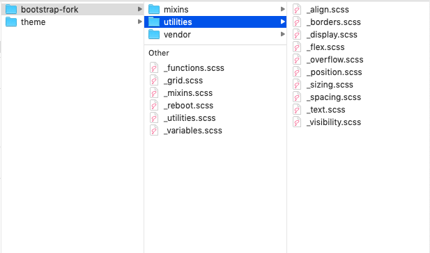
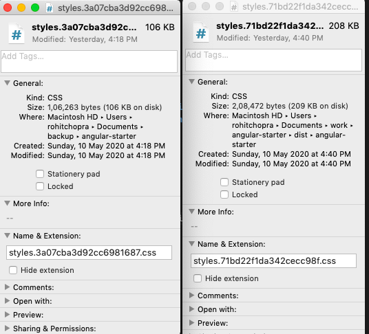

<h1 align="center">Angular Material weds Bootstrap</h1>

<article align="center">
   
</article>

# You might be using bootstrap the WRONG WAY !
**This post is for those who `care for every byte downloaded` from the server to the client machine**

<p style="display:flex;align-items:flex-start;">
    
   <span style="padding-left:16px; display:flex;flex-direction:column; justify-content:space-between;">Hi, I am Rohit Chopra, an angular developer with strong focus on <b>application performance and maintainability.</b>
   <br/>
   <span>I am always willing to have a healthy debate about technology. So drop me a mail at <a href="mailto:crohit92@gmail.com">crohit92@gmail.com</a> anytime to start a discussion. 
   </span>
   </span>
</p>


I have been using angular along with angular material since 2015 because of the obvious reason that angular material is written in angular and it feels like a part of the framework. I don't feel that i am working on two different technologies, it's rather only angular with some prebuilt components available out of the box.

## Motivation for this post

Angular material is a great library but it is limited only to a set of components. There is no doubt that those components are written with great thought and they are highly flexible. They provide functionality which is neither less nor more than the intended.

But every frontend developer knows that there is much more required than just a toolkit of reusable components. 

We need: 
- Reusable CSS classes to size elements
- Reusable CSS classes to position elements on screen
- Reusable CSS utility classes for various properties like
   - display
   - visibility
   - position
   - padding
   - margin
   - width
   - and many more...
- A grid framework which is intutive and easy to understand and at the same time very robust.
- Responsive CSS utilities to adapts to the device width.

**All the above requirements point to one of the most famous design libraries i.e. `Bootstrap`**  

## The Necessary Evil - `Bootstrap`

Due to the requirements mentioned above, frontend devs generally end up using bootstrap in their project along with other design libraries(for components), like Angular Material in my case.

But why am i calling bootstrap an `Evil`? 

What is wrong in having two libraries when one just provides components and the other provide layout. They must be a perfect mix right ?

## Consequence of having bootstrap with Angular Material

There are some issues, I want to point out, which occur when we use both these design libraries together.

- The download bundle size increases more than the required
   - Because bootstrap does not by default allow you to pick and choose what features you want from it. You have to take everything as a single bundle.
- Bootstrap uses `!important` for almost every css utility which i hate the most. I always use the [Specificity rule](https://developer.mozilla.org/en-US/docs/Web/CSS/Specificity) to override my styles when required. Using !important is a bad way of writing and should be avoided always.
- Extra scripting library `jquery` which is not recommended with Angular.
- Even extra JS for bootstrap as well - `bootstrap.js`

The above consequences should be enough to start thinking of a better solution.

## Let's solve this problem !

*The solution is not to remove bootstrap and write all the code by ourselves !* It would be reinvention of the wheel.

We will pick and choose what we want from bootstrap and drop everything else.

**Seems like a nice idea !**

Yes it is! and is very simple aswell.

### We need to follow 6 simple steps:

1. Create a directory under `<your-app-root-directory>/src` by the name `scss`.
2. Create a directory under `<your-app-root-directory>/src/scss` by the name `bootstrap-fork`.
3. Download bootstrap source code from [here](https://github.com/twbs/bootstrap/archive/v4.0.0.zip) and extract it. Put the content of scss(inside the extracted source code) directory in the `bootstrap-fork` directory(inside your project)
4. Open the style.scss file of youe app and paste the below code in it.
   ```scss
   @import "./scss/bootstrap-fork/functions";
   @import "./scss/bootstrap-fork/variables";

   @import "./scss/bootstrap-fork/mixins";

   @import "./scss/bootstrap-fork/grid";
   @import "./scss/bootstrap-fork/utilities";

   @import "./scss/bootstrap-fork/reboot";


   html,
   body {
     box-sizing: border-box;
     -ms-overflow-style: scrollbar;
     height: 100%;
   }
   *,
   *::before,
   *::after {
     box-sizing: inherit;
   }
   ```
   The above step adds 
   - The Bootstrap Reboot
   - The Bootstrap Grid
   - All Bootstrap Utilities

   to your project without any bootstrap components, so that you don't get what you don't want.
5. Now in your editor find and remove all occurances of `!important` inside `bootstrap-fork`.
6. [Optional] Inside boostrap-fork remove the files which you don't want.

**The last step needs deep understanding of the source code to figure out the relationship of all files to each other**

I will show the content of bootstrap-fork in one of my apps:



As you see I have removed all the components inside bootstrap and from utilities also, I have kept only the ones I required.

To remove the utility files, I had to edit the root `_utilities.scss` to have the following content:

```scss
@import "utilities/align";
@import "utilities/borders";
@import "utilities/display";
@import "utilities/flex";
@import "utilities/overflow";
@import "utilities/position";
@import "utilities/sizing";
@import "utilities/spacing";
@import "utilities/text";
@import "utilities/visibility";
```

**Important! Mixins need not be removed, since they will not end up in the final bundle as the scss processor will process them and remove those files**

So don't bother about mixins !


## What did i achieve ?

The following image shows the final css bundle size of the same app with:

Left(The forked version of bootstrap) and Right(Complete bootstrap library)



As you can see there is a `50% reduction in size of the bundle.`

I have put the source code [here](https://github.com/crohit92/angular-starter) for reference.

---
Hope you found the content useful and interesting. Please reach out to me for any feedback or suggestions. If you have your own idea to solve the same problem, please do share.

Happy Coding :)